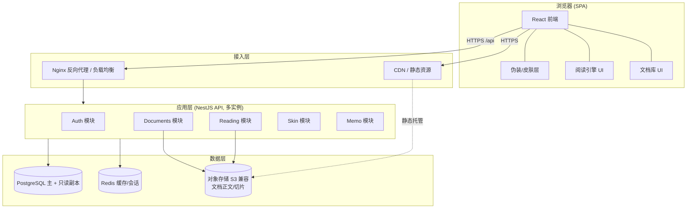
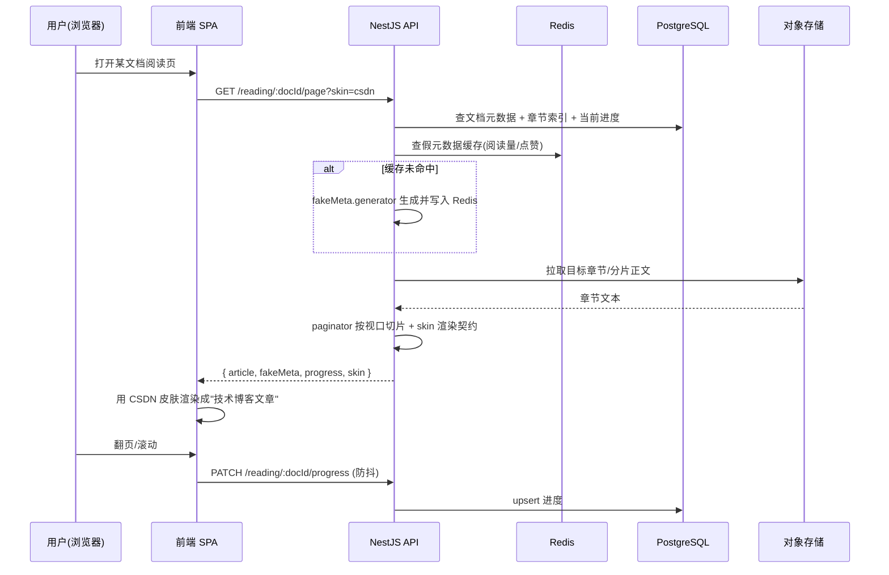
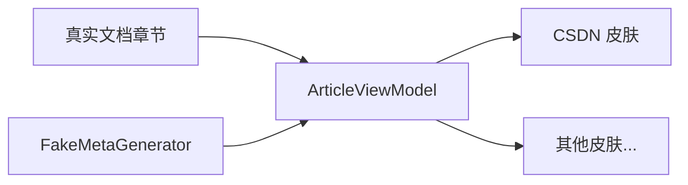
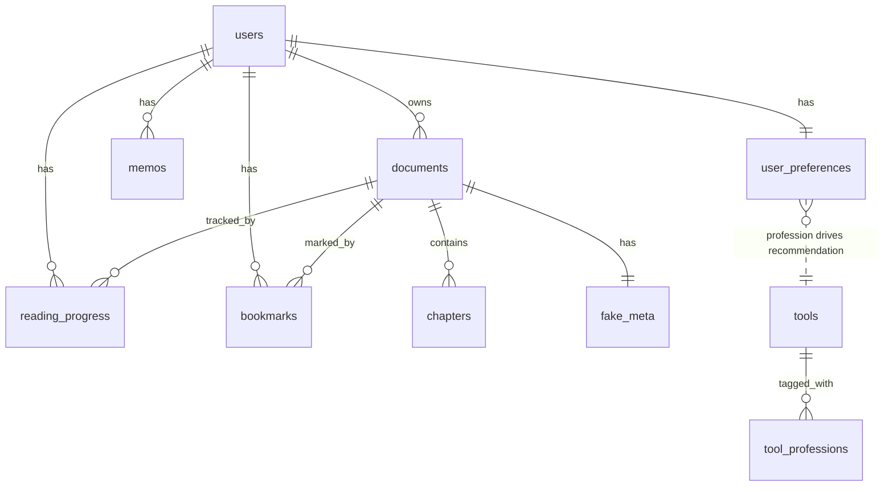
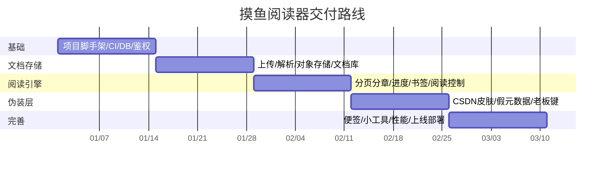
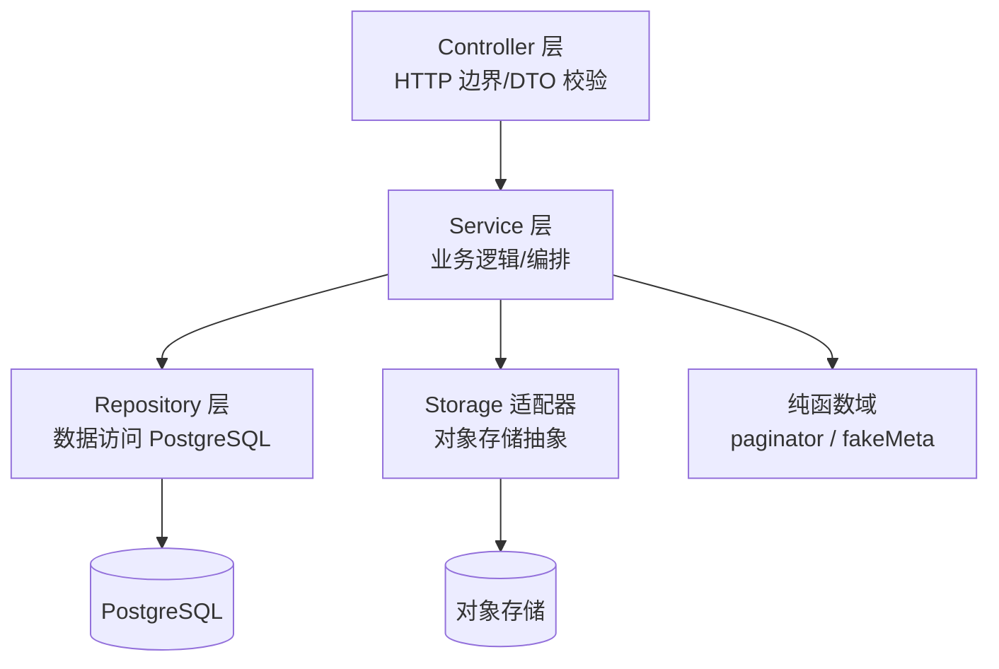
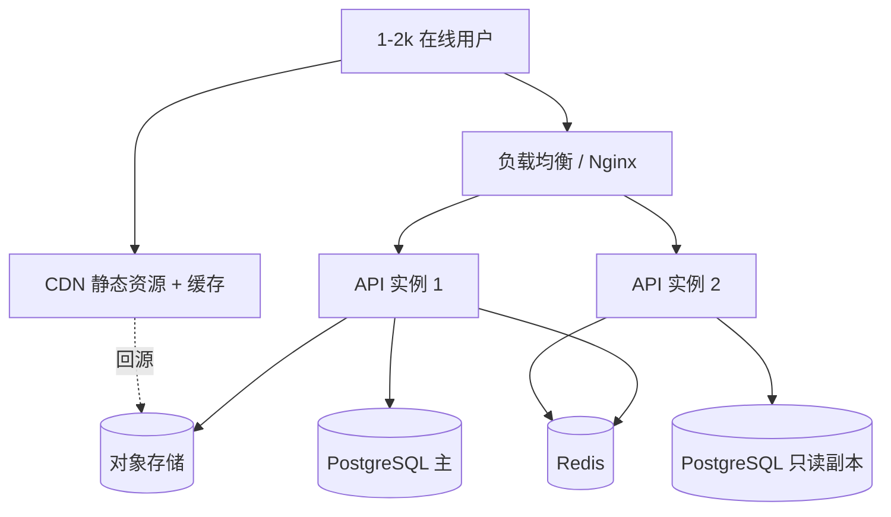

# 设计文档：摸鱼阅读器（Stealth Reader）

> 一个"伪装成 CSDN 风格技术博客"的**个人自有内容**阅读器。用户上传并阅读**自己合法拥有**的 txt/文本文档，阅读界面伪装成技术博客文章页，融入办公环境。**本项目仅面向自有内容，不涉及盗版小说、赌博、聊天等内容。**

## Overview

摸鱼阅读器是一个自托管的 Web 应用，核心价值是"低调阅读"：把用户上传的纯文本文档，渲染成看起来像一篇技术博客文章的页面（带假的阅读量/点赞/收藏/标签/专栏等元数据），从而在办公场景中不显眼。

系统采用前后端分离架构：前端为 React + TypeScript 单页应用（SPA），后端为 NestJS（Node.js + TypeScript）REST API，数据库使用 PostgreSQL，文档正文存放于对象存储（S3 兼容）。设计上刻意将三层解耦——**伪装/皮肤层（Skin）**、**阅读引擎层（Reading Engine）**、**文档存储层（Document Storage）**，使得皮肤可替换、阅读逻辑可独立演进、存储可横向扩展。

本设计文档按用户要求，将 6 大关切点清晰分离：文件分类（模块组织）、架构设计、产品设计、建表、时间周期规划、业务代码分层。文末附针对 1–2k 活跃/在线用户规模的容量与部署规划。

---

## 关切点 1：文件分类（模块 / 项目结构组织）

清晰的 monorepo 结构，前端、后端、共享类型三包分离；后端内部按"伪装层 / 阅读引擎 / 文档存储"三大领域再分模块。

```text
stealth-reader/
├─ packages/
│  ├─ shared/                     # 前后端共享的类型与常量（TS types, DTO 接口, 枚举）
│  │  └─ src/
│  │     ├─ types/                # Document, ReadingProgress, Memo, SkinTheme, FakeMeta...
│  │     └─ constants/            # 主题枚举、分页默认值等
│  │
│  ├─ backend/                    # NestJS API
│  │  └─ src/
│  │     ├─ main.ts
│  │     ├─ app.module.ts
│  │     ├─ common/               # 通用：拦截器、异常过滤器、鉴权守卫、分页工具
│  │     ├─ modules/
│  │     │  ├─ auth/              # 用户认证（注册/登录/JWT）
│  │     │  ├─ documents/        # 【文档存储领域】上传、解析、库管理
│  │     │  │  ├─ documents.controller.ts
│  │     │  │  ├─ documents.service.ts        # 业务逻辑（应用层）
│  │     │  │  ├─ document.repository.ts      # 数据访问（仓储层）
│  │     │  │  ├─ storage/                    # 对象存储适配器（S3/本地）
│  │     │  │  └─ parsing/                    # txt 分章/编码探测/分页切片
│  │     │  ├─ reading/          # 【阅读引擎领域】进度、分页、书签
│  │     │  │  ├─ reading.controller.ts
│  │     │  │  ├─ reading.service.ts
│  │     │  │  ├─ progress.repository.ts
│  │     │  │  └─ paginator.ts                # 纯函数：正文 -> 分页/分章
│  │     │  ├─ skin/             # 【伪装/皮肤领域】模板、假元数据生成
│  │     │  │  ├─ skin.controller.ts
│  │     │  │  ├─ skin.service.ts
│  │     │  │  └─ fake-meta.generator.ts      # 生成阅读量/点赞/标签等假数据
│  │     │  ├─ tools/            # 【工具页领域】工具聚合、职业化推荐、分类/搜索
│  │     │  │  ├─ tools.controller.ts         # HTTP 边界：列表/筛选/推荐/启动
│  │     │  │  ├─ tools.service.ts            # 业务编排：目录管理、推荐、持久化职业
│  │     │  │  ├─ tool.repository.ts          # 工具目录/职业标签数据访问
│  │     │  │  └─ recommender.ts              # 纯函数：按职业推荐 + 分类/搜索筛选
│  │     │  ├─ memo/             # 便签（自动保存）
│  │     │  └─ widgets/          # 摸鱼小工具（下班倒计时等，纯前端为主，后端存配置）
│  │     └─ config/               # 环境配置、数据库连接、对象存储配置
│  │
│  └─ frontend/                   # React + TS SPA
│     └─ src/
│        ├─ main.tsx
│        ├─ app/                  # 路由、全局 Provider
│        ├─ api/                  # API client（对接 backend，按领域拆分）
│        ├─ features/
│        │  ├─ library/          # 文档库：列表、上传、删除、搜索
│        │  ├─ reader/           # 【阅读引擎 UI】翻页、进度、字体控制、老板键
│        │  ├─ skins/            # 【伪装层 UI】CSDN 皮肤、模板切换、假元数据渲染
│        │  │  └─ csdn/          # CSDN 风格皮肤组件（可插拔）
│        │  ├─ memo/             # 便签组件（防抖自动保存）
│        │  ├─ tools/            # 【工具页 UI】工具聚合页、职业选择器、工具卡片/启动、分类筛选/搜索
│        │  └─ widgets/          # 下班倒计时等小挂件
│        ├─ components/          # 通用 UI 组件
│        ├─ hooks/               # useReadingProgress, useAutoSave, useBossKey...
│        └─ styles/              # 主题变量、皮肤样式（CSS-in-TS 或 CSS Modules）
│
├─ infra/                         # 部署：docker-compose、IaC、Nginx 配置
├─ docs/                          # 附加文档
├─ package.json                   # workspace 根
└─ tsconfig.base.json
```

**分层与领域映射（三大解耦目标）：**

| 目标解耦层 | 后端模块 | 前端 feature | 职责 |
|---|---|---|---|
| 伪装 / 皮肤层 | `skin/` | `features/skins/` | 模板选择、假元数据、CSDN 视觉，可插拔可替换 |
| 阅读引擎层 | `reading/` | `features/reader/` | 分页/分章、进度、书签、阅读控制 |
| 文档存储层 | `documents/` | `features/library/` | 上传、解析、对象存储、库管理 |
| 工具页领域 | `tools/` | `features/tools/` | 工具聚合目录、职业化推荐、分类/搜索、工具启动（自有合规工具） |

---

## Architecture
<!-- 关切点 2：架构设计（High-Level Architecture） -->

### 2.1 系统架构图



### 2.2 架构要点

- **无状态应用层**：NestJS 实例不保存会话状态，会话/JWT 与缓存放 Redis，便于水平扩展多实例。
- **正文与元数据分离**：文档元数据（标题、章节索引、进度）存 PostgreSQL；文档正文（可能较大）存对象存储，按章节/分片存放，按需拉取，降低数据库压力。
- **伪装层可插拔**：皮肤以"模板注册表 + 数据契约"方式实现，新增皮肤不改阅读引擎。
- **缓存策略**：热点文档章节内容、假元数据在 Redis / CDN 缓存，读多写少。
- **安全边界**：所有文档访问经鉴权守卫；每个文档归属唯一 owner，禁止跨用户访问。

### 2.3 阅读主流程时序图



---

## 关切点 3：产品设计（Product Design）

### 3.1 核心功能列表

| 功能域 | 功能 | 说明 |
|---|---|---|
| 文档库 | 上传文档 | 支持 .txt（首期）；自有内容声明确认 |
| 文档库 | 浏览/搜索/删除 | 列表分页、按标题搜索、软删除 |
| 文档库 | 编码/分章探测 | 自动探测编码（UTF-8/GBK），按常见章节规则分章 |
| 阅读引擎 | 伪装阅读视图 | 正文渲染成技术博客文章样式 |
| 阅读引擎 | 阅读控制 | 字号、行距、翻页/滚动模式、明暗主题 |
| 阅读引擎 | 进度记录 | 自动记录并跨设备恢复阅读位置 |
| 阅读引擎 | 书签/目录 | 章节目录跳转、手动书签 |
| 阅读引擎 | 老板键 | 快捷键一键切换到"正经页面"或最小化 |
| 伪装/皮肤 | CSDN 皮肤 | 假标题栏、面包屑、阅读量/点赞/收藏/标签/专栏、评论区外观 |
| 伪装/皮肤 | 假元数据 | 生成稳定的伪造统计数字（对同一文档保持一致） |
| 伪装/皮肤 | 模板切换 | 多套皮肤可切换（预留），皮肤与内容解耦 |
| 便签 | Memo 自动保存 | 侧边便签，防抖自动保存，跨会话保留 |
| 小工具 | 下班倒计时等 | 纯前端挂件，配置存后端 |
| 工具页 | 工具聚合页 | 聚合展示自有合规实用小工具目录（可用工具列表） |
| 工具页 | 职业选择与推荐 | 选择职业（开发/设计/运营/财务/销售/学生/其他），据此推荐相关工具 |
| 工具页 | 按分类 / 搜索 | 按工具分类筛选或按名称关键字搜索，无匹配给出空态提示 |
| 工具页 | 启动工具 | 打开选定工具并返回其可用状态 |
| 账户 | 注册/登录 | JWT 鉴权，文档归属隔离 |

### 3.2 关键 UX 说明

- **伪装保真度**：阅读页的 DOM 结构、标题、URL 路径（如 `/blog/article/:slug`）尽量贴近真实技术博客，浏览器标签页标题显示"XXX_CSDN博客"。
- **老板键（Boss Key）**：按下预设快捷键（如 `Esc` 或自定义）立即切换为一张预置的"正经内容"页面或空白文档，并暂停进度上报；再次按下恢复。
- **假元数据一致性**：同一文档的阅读量/点赞数在多次访问间保持稳定（由 docId 派生的确定性随机），避免穿帮。
- **无侵入自动保存**：进度与便签均采用防抖自动保存，用户无需手动操作。
- **职业化工具推荐**：工具页顶部提供职业选择器，用户选定职业后即时呈现与其岗位最相关的工具；所选职业持久化到用户偏好，下次（含新会话）进入工具页时自动按已保存职业生成推荐，无需重复选择。
- **工具合规策略**：工具目录为**人工精选（curated）**的自有合规实用小工具（如下班倒计时、单位/格式转换、文本处理、计算器、计时器、JSON/时间戳/正则、汇率/日期计算等）；**明确不收录任何赌博、博彩、盗版或违法玩法工具**，与全站合规框架一致。

### 3.3 伪装层数据契约（Skin Contract）

皮肤只消费一个标准化的"文章视图模型"，与文档真实内容解耦：



---

## Data Models
<!-- 关切点 4：建表（数据库表设计 / Schema） -->

PostgreSQL。正文不入库，仅存元数据、索引与用户数据。以下为核心表（DDL 概要）。

```sql
-- 用户
CREATE TABLE users (
    id            UUID PRIMARY KEY DEFAULT gen_random_uuid(),
    email         VARCHAR(255) UNIQUE NOT NULL,
    password_hash VARCHAR(255) NOT NULL,
    display_name  VARCHAR(100),
    created_at    TIMESTAMPTZ NOT NULL DEFAULT now(),
    updated_at    TIMESTAMPTZ NOT NULL DEFAULT now()
);

-- 文档（元数据；正文在对象存储）
CREATE TABLE documents (
    id             UUID PRIMARY KEY DEFAULT gen_random_uuid(),
    owner_id       UUID NOT NULL REFERENCES users(id) ON DELETE CASCADE,
    title          VARCHAR(500) NOT NULL,
    original_name  VARCHAR(500),
    encoding       VARCHAR(20)  NOT NULL DEFAULT 'utf-8',
    char_count     BIGINT       NOT NULL DEFAULT 0,
    chapter_count  INT          NOT NULL DEFAULT 0,
    storage_key    VARCHAR(500) NOT NULL,           -- 对象存储根 key（正文/切片前缀）
    status         VARCHAR(20)  NOT NULL DEFAULT 'processing', -- processing|ready|failed
    deleted_at     TIMESTAMPTZ,                     -- 软删除
    created_at     TIMESTAMPTZ  NOT NULL DEFAULT now(),
    updated_at     TIMESTAMPTZ  NOT NULL DEFAULT now()
);
CREATE INDEX idx_documents_owner ON documents(owner_id) WHERE deleted_at IS NULL;

-- 章节索引（每章在对象存储里的定位；正文不入库）
CREATE TABLE chapters (
    id            UUID PRIMARY KEY DEFAULT gen_random_uuid(),
    document_id   UUID NOT NULL REFERENCES documents(id) ON DELETE CASCADE,
    idx           INT  NOT NULL,                    -- 章节序号，从 0 开始
    title         VARCHAR(500),
    char_offset   BIGINT NOT NULL,                  -- 在全文中的起始字符偏移
    char_length   INT    NOT NULL,
    storage_key   VARCHAR(500) NOT NULL,            -- 该章正文在对象存储的 key
    UNIQUE (document_id, idx)
);
CREATE INDEX idx_chapters_doc ON chapters(document_id);

-- 阅读进度（每用户每文档一条）
CREATE TABLE reading_progress (
    id             UUID PRIMARY KEY DEFAULT gen_random_uuid(),
    user_id        UUID NOT NULL REFERENCES users(id) ON DELETE CASCADE,
    document_id    UUID NOT NULL REFERENCES documents(id) ON DELETE CASCADE,
    chapter_idx    INT    NOT NULL DEFAULT 0,
    char_offset    BIGINT NOT NULL DEFAULT 0,        -- 章节内偏移
    percent        NUMERIC(5,2) NOT NULL DEFAULT 0,  -- 全书百分比
    updated_at     TIMESTAMPTZ NOT NULL DEFAULT now(),
    UNIQUE (user_id, document_id)
);

-- 书签
CREATE TABLE bookmarks (
    id           UUID PRIMARY KEY DEFAULT gen_random_uuid(),
    user_id      UUID NOT NULL REFERENCES users(id) ON DELETE CASCADE,
    document_id  UUID NOT NULL REFERENCES documents(id) ON DELETE CASCADE,
    chapter_idx  INT NOT NULL,
    char_offset  BIGINT NOT NULL,
    note         VARCHAR(500),
    created_at   TIMESTAMPTZ NOT NULL DEFAULT now()
);
CREATE INDEX idx_bookmarks_user_doc ON bookmarks(user_id, document_id);

-- 便签（自动保存）
CREATE TABLE memos (
    id          UUID PRIMARY KEY DEFAULT gen_random_uuid(),
    user_id     UUID NOT NULL REFERENCES users(id) ON DELETE CASCADE,
    content     TEXT NOT NULL DEFAULT '',
    updated_at  TIMESTAMPTZ NOT NULL DEFAULT now()
);
CREATE INDEX idx_memos_user ON memos(user_id);

-- 假元数据（伪装层；同一文档稳定一致）
CREATE TABLE fake_meta (
    document_id  UUID PRIMARY KEY REFERENCES documents(id) ON DELETE CASCADE,
    views        INT NOT NULL,
    likes        INT NOT NULL,
    favorites    INT NOT NULL,
    tags         TEXT[] NOT NULL DEFAULT '{}',
    column_name  VARCHAR(200),                       -- 假"专栏"名
    published_at TIMESTAMPTZ NOT NULL DEFAULT now(),
    seed         BIGINT NOT NULL                      -- 由 docId 派生，保证可重现
);

-- 用户偏好（皮肤、阅读设置、老板键等）
CREATE TABLE user_preferences (
    user_id      UUID PRIMARY KEY REFERENCES users(id) ON DELETE CASCADE,
    active_skin  VARCHAR(50) NOT NULL DEFAULT 'csdn',
    font_size    INT NOT NULL DEFAULT 16,
    line_height  NUMERIC(3,1) NOT NULL DEFAULT 1.8,
    theme        VARCHAR(20) NOT NULL DEFAULT 'light', -- light|dark
    boss_key     VARCHAR(20) NOT NULL DEFAULT 'Escape',
    profession   VARCHAR(20),                          -- 职业偏好，可空；取值 ∈ {开发,设计,运营,财务,销售,学生,其他}
    settings     JSONB NOT NULL DEFAULT '{}',          -- 小工具等扩展配置
    updated_at   TIMESTAMPTZ NOT NULL DEFAULT now(),
    CONSTRAINT chk_profession CHECK (
        profession IS NULL OR
        profession IN ('开发','设计','运营','财务','销售','学生','其他')
    )
);

-- 工具目录（人工精选的自有合规实用工具；工具本体多为前端实现，此处存元数据用于聚合/检索/推荐）
CREATE TABLE tools (
    id           UUID PRIMARY KEY DEFAULT gen_random_uuid(),
    slug         VARCHAR(64) UNIQUE NOT NULL,          -- 稳定 key/slug，前端据此加载对应工具组件
    name         VARCHAR(200) NOT NULL,
    category     VARCHAR(50)  NOT NULL,                -- 工具分类（如 开发者/文本/计算/时间/转换）
    description  VARCHAR(500),
    icon         VARCHAR(200),                         -- 图标标识或资源 key
    enabled      BOOLEAN      NOT NULL DEFAULT true,   -- 是否上架可用
    created_at   TIMESTAMPTZ  NOT NULL DEFAULT now()
);
CREATE INDEX idx_tools_category ON tools(category) WHERE enabled = true;

-- 工具↔职业 多对多映射（junction table）
-- 采用连接表而非在 tools 上放 professions TEXT[]：便于按职业高效检索（可对 profession 建索引）、
-- 保证取值受控（CHECK 约束）、且一个工具可归属多个职业，关系更规范、易维护。
CREATE TABLE tool_professions (
    tool_id     UUID NOT NULL REFERENCES tools(id) ON DELETE CASCADE,
    profession  VARCHAR(20) NOT NULL,                  -- 职业标签，取值同 user_preferences.profession
    PRIMARY KEY (tool_id, profession),
    CONSTRAINT chk_tool_profession CHECK (
        profession IN ('开发','设计','运营','财务','销售','学生','其他')
    )
);
CREATE INDEX idx_tool_professions_profession ON tool_professions(profession);
```

**ER 关系图：**



> **说明**：`user_preferences.profession` 与 `tool_professions.profession` 取值同一受支持职业集合；职业化推荐即以用户偏好中的 `profession` 去匹配 `tool_professions` 中带该职业标签的 `tools`（`enabled = true`）。

---

## 关切点 5：时间周期规划（Timeline / 分阶段交付）

按里程碑分 5 期，总计约 10–12 周（单人/小团队节奏，可并行压缩）。



| 里程碑 | 周期 | 目标产出 | 验收标准 |
|---|---|---|---|
| M1 基础设施 | 第 1–2 周 | Monorepo、CI/CD、PostgreSQL、Redis、JWT 认证 | 可注册登录，健康检查通过 |
| M2 文档存储 | 第 3–4 周 | 上传/编码探测/分章/对象存储/文档库 CRUD | 上传 txt 后生成章节索引，库列表可见 |
| M3 阅读引擎 | 第 5–6 周 | 分页器、进度自动保存/恢复、书签、目录、阅读控制 | 跨设备恢复阅读位置准确 |
| M4 伪装层 | 第 7–8 周 | CSDN 皮肤、假元数据（稳定一致）、老板键、模板切换框架 | 阅读页外观可信、老板键即时切换 |
| M5 完善上线 | 第 9–10 周 | 便签自动保存、下班倒计时等小工具、缓存/CDN、部署上线 | 通过性能压测，正式部署 |

预留 2 周缓冲（第 11–12 周）用于修复、打磨与灰度。

---

## Components and Interfaces
<!-- 关切点 6：业务代码分层（Business Code Layering） -->

严格分层，业务逻辑集中在 Service 层，与框架/IO 解耦；纯逻辑（分页、假元数据）做成纯函数便于测试。



**分层原则：**
- **Controller**：只做 HTTP 边界、DTO 校验、鉴权，不含业务逻辑。
- **Service**：承载业务规则与编排（跨仓储/存储/纯函数），可单元测试。
- **Repository**：封装 SQL/ORM，返回领域对象。
- **Storage 适配器**：抽象接口 `StoragePort`，实现可切换（S3 / 本地 / MinIO）。
- **纯函数域**：`paginator`、`fakeMeta.generator` 无副作用，最易测试。

### 6.1 共享类型（packages/shared）

```typescript
// packages/shared/src/types/document.ts
export type DocumentStatus = 'processing' | 'ready' | 'failed';

export interface DocumentMeta {
  id: string;
  ownerId: string;
  title: string;
  encoding: string;
  charCount: number;
  chapterCount: number;
  status: DocumentStatus;
  createdAt: string;
}

export interface ChapterIndex {
  idx: number;
  title: string | null;
  charOffset: number;
  charLength: number;
  storageKey: string;
}

export interface ReadingProgress {
  documentId: string;
  chapterIdx: number;
  charOffset: number;
  percent: number;
}

// 伪装层消费的标准视图模型（与真实内容解耦）
export interface FakeMeta {
  views: number;
  likes: number;
  favorites: number;
  tags: string[];
  columnName: string | null;
  publishedAt: string;
}

export interface ArticleViewModel {
  articleTitle: string;   // 伪装标题（可用章节标题）
  htmlBody: string;       // 已渲染为"博客正文"的 HTML
  fakeMeta: FakeMeta;
  progress: ReadingProgress;
  skinId: string;
}

// packages/shared/src/types/tool.ts

// 受支持职业集合（与 requirements.md Requirement 14 一致）
export enum Profession {
  Dev = '开发',
  Design = '设计',
  Ops = '运营',
  Finance = '财务',
  Sales = '销售',
  Student = '学生',
  Other = '其他',
}

// 工具目录中的单个工具（自有合规实用小工具）
export interface Tool {
  id: string;
  slug: string;              // 稳定 key，前端据此加载工具组件
  name: string;
  category: string;
  description: string | null;
  icon: string | null;
  enabled: boolean;
  professions: Profession[]; // 该工具的职业标签集合（来自 tool_professions）
}

// 工具筛选 / 搜索查询
export interface ToolQuery {
  category?: string;         // 按分类精确匹配
  query?: string;            // 按名称关键字模糊匹配（大小写/空白规整后包含）
}

// 职业化推荐结果
export interface ToolRecommendation {
  profession: Profession;
  tools: Tool[];             // 每个工具的 professions 均包含 profession
}
```

### 6.2 存储适配器接口（Storage Port）

```typescript
// backend/src/modules/documents/storage/storage.port.ts
export interface StoragePort {
  // 保存单个章节正文，返回 storageKey
  putChapter(docId: string, idx: number, content: string): Promise<string>;
  // 读取章节正文
  getChapter(storageKey: string): Promise<string>;
  // 删除文档全部正文
  deleteDocument(docId: string): Promise<void>;
}
```

### 6.3 关键函数签名与形式化规格

#### 6.3.1 文档解析：分章 + 编码探测

```typescript
// backend/src/modules/documents/parsing/parser.ts

/**
 * 探测缓冲区文本编码。
 * Preconditions:
 *   - buffer 非空 (buffer.length > 0)
 * Postconditions:
 *   - 返回值 ∈ 支持的编码集合 {'utf-8','gbk','gb2312','utf-16le'}
 *   - 不修改入参 buffer
 */
export function detectEncoding(buffer: Buffer): string;

/**
 * 将全文文本切分为章节。
 * Preconditions:
 *   - text 为已解码的完整文本（可为空字符串）
 * Postconditions:
 *   - 返回 chapters 满足：
 *       ∀ i: chapters[i].idx === i
 *       chapters[0].charOffset === 0
 *       ∀ i>0: chapters[i].charOffset === chapters[i-1].charOffset + chapters[i-1].charLength
 *       Σ chapters[i].charLength === text.length
 *   - 若未匹配到任何章节标题，则返回单章（整篇作为一章）
 *   - 无副作用
 */
export function splitChapters(
  text: string
): Array<Omit<ChapterIndex, 'storageKey'>>;
```

#### 6.3.2 阅读引擎：分页器（纯函数）

```typescript
// backend/src/modules/reading/paginator.ts

export interface PageRequest {
  chapterText: string;
  charOffset: number;    // 从章节内该偏移开始
  charsPerPage: number;  // 视口每页字符数（前端传入）
}

export interface Page {
  content: string;
  startOffset: number;
  endOffset: number;
  hasNext: boolean;
}

/**
 * 从章节文本中截取一页。
 * Preconditions:
 *   - 0 <= charOffset <= chapterText.length
 *   - charsPerPage > 0
 * Postconditions:
 *   - page.startOffset === charOffset
 *   - page.endOffset === min(charOffset + charsPerPage, chapterText.length)
 *   - page.content === chapterText.slice(startOffset, endOffset)
 *   - page.hasNext === (endOffset < chapterText.length)
 *   - 无副作用（不修改 chapterText）
 */
export function getPage(req: PageRequest): Page;
```

#### 6.3.3 伪装层：假元数据生成（确定性）

```typescript
// backend/src/modules/skin/fake-meta.generator.ts

/**
 * 由文档 id 派生稳定的假元数据（同一 docId 永远得到相同结果）。
 * Preconditions:
 *   - docId 为非空 UUID 字符串
 * Postconditions:
 *   - 结果对同一 docId 幂等（多次调用相等）
 *   - views >= likes >= 0 且 views >= favorites >= 0
 *   - tags.length ∈ [1, 5]
 *   - 无副作用
 */
export function generateFakeMeta(docId: string): FakeMeta;
```

#### 6.3.4 Service 层编排示例（阅读页组装）

```typescript
// backend/src/modules/reading/reading.service.ts

export class ReadingService {
  constructor(
    private readonly progressRepo: ProgressRepository,
    private readonly chapterRepo: ChapterRepository,
    private readonly storage: StoragePort,
    private readonly skinService: SkinService,
  ) {}

  /**
   * 组装某用户某文档的阅读视图模型。
   * Preconditions:
   *   - userId 拥有 documentId（否则抛 ForbiddenException）
   *   - document.status === 'ready'
   * Postconditions:
   *   - 返回 ArticleViewModel，其 progress 反映用户当前进度
   *   - fakeMeta 对同一 documentId 稳定一致
   */
  async getArticleView(
    userId: string,
    documentId: string,
    skinId: string,
  ): Promise<ArticleViewModel> {
    const progress = await this.progressRepo.getOrInit(userId, documentId);
    const chapter = await this.chapterRepo.getByIdx(documentId, progress.chapterIdx);
    const rawText = await this.storage.getChapter(chapter.storageKey);
    const page = getPage({
      chapterText: rawText,
      charOffset: progress.charOffset,
      charsPerPage: DEFAULT_CHARS_PER_PAGE,
    });
    return this.skinService.render(skinId, {
      title: chapter.title ?? '未命名章节',
      body: page.content,
      documentId,
      progress,
    });
  }

  /**
   * 保存阅读进度（幂等 upsert）。
   * Postconditions:
   *   - reading_progress 中 (userId, documentId) 唯一一条被更新
   *   - percent ∈ [0, 100]
   */
  async saveProgress(userId: string, p: ReadingProgress): Promise<void> {
    await this.progressRepo.upsert(userId, p);
  }
}
```

#### 6.3.5 工具页：职业化推荐与筛选（纯函数）

工具页的核心逻辑（推荐、筛选/搜索）实现为无副作用的纯函数 `recommender.ts`，输入为完整工具目录（由 `tool.repository.ts` 从 DB 载入），便于属性测试；`tools.service.ts` 仅负责载入目录、调用纯函数并持久化职业偏好。

```typescript
// backend/src/modules/tools/recommender.ts

/**
 * 依据职业从工具目录中推荐相关工具。
 * Preconditions:
 *   - catalog 为工具目录（可为空数组）
 *   - profession ∈ Profession 受支持集合
 * Postconditions:
 *   - 返回集合中每个 tool 都满足 tool.professions.includes(profession)
 *       （不推荐职业标签不含该职业的工具 —— 对齐 Correctness Property 7）
 *   - 返回集合中每个 tool 都满足 tool.enabled === true
 *   - 返回集合是 catalog 的子集（不臆造工具）
 *   - 无副作用（不修改 catalog）
 */
export function recommendTools(catalog: Tool[], profession: Profession): Tool[];

/**
 * 按分类 / 名称关键字筛选工具目录。
 * 查询谓词 matches(tool, q):
 *   (q.category 未提供 或 tool.category === q.category)
 *   AND (q.query 未提供 或 normalize(tool.name).includes(normalize(q.query)))
 * Preconditions:
 *   - catalog 为工具目录（可为空数组）
 *   - q 为合法查询（category / query 均可选）
 * Postconditions:
 *   - 返回集合中每个 tool 都满足 matches(tool, q) === true
 *       （不返回不匹配工具 —— 对齐 Correctness Property 8）
 *   - catalog 中所有满足 matches 的工具都出现在返回集合中（不漏）
 *   - 返回集合是 catalog 的子集，无重复
 *   - 无副作用（不修改 catalog）
 */
export function filterTools(catalog: Tool[], q: ToolQuery): Tool[];
```

```typescript
// backend/src/modules/tools/tools.service.ts（编排示例，节选）

export class ToolsService {
  constructor(
    private readonly toolRepo: ToolRepository,
    private readonly prefsRepo: PreferencesRepository,
  ) {}

  /**
   * 选择职业：持久化到用户偏好，并返回据此生成的推荐。
   * Postconditions:
   *   - user_preferences.profession === profession（往返一致 —— 对齐 Property 9）
   *   - 返回的每个工具的 professions 均包含 profession
   */
  async selectProfession(
    userId: string,
    profession: Profession,
  ): Promise<ToolRecommendation> {
    await this.prefsRepo.setProfession(userId, profession); // 持久化（Req 14.6）
    const catalog = await this.toolRepo.listEnabledWithProfessions();
    return { profession, tools: recommendTools(catalog, profession) };
  }

  /**
   * 新会话进入工具页：使用已持久化职业生成推荐（Req 14.7）。
   * Postconditions:
   *   - 若用户已设置职业，则推荐等价于对该职业直接调用 recommendTools（跨会话一致）
   */
  async getRecommendationForUser(userId: string): Promise<ToolRecommendation | null> {
    const profession = await this.prefsRepo.getProfession(userId);
    if (!profession) return null;
    const catalog = await this.toolRepo.listEnabledWithProfessions();
    return { profession, tools: recommendTools(catalog, profession) };
  }
}
```

### 6.4 REST API 概要

| Method | Path | 说明 |
|---|---|---|
| POST | `/auth/register` / `/auth/login` | 注册 / 登录（返回 JWT） |
| POST | `/documents` | 上传文档（multipart） |
| GET | `/documents` | 文档库列表（分页/搜索） |
| DELETE | `/documents/:id` | 软删除文档 |
| GET | `/reading/:docId/article` | 获取伪装阅读视图（含皮肤/假元数据/进度） |
| PATCH | `/reading/:docId/progress` | 保存阅读进度 |
| GET/POST/DELETE | `/reading/:docId/bookmarks` | 书签管理 |
| GET | `/skins` | 可用皮肤列表 |
| GET/PUT | `/memo` | 便签读取 / 自动保存 |
| GET/PUT | `/preferences` | 用户偏好（皮肤/字号/老板键/职业）；`PUT` 现同时持久化 `profession`（Property 9 往返一致） |
| GET | `/tools` | 工具聚合页：列出所有可用工具（Req 14.1） |
| GET | `/tools?category=&q=` | 按分类筛选 / 按名称关键字搜索（Req 14.3；无匹配返回空集 + 提示，Req 14.4） |
| GET | `/tools/recommend?profession=` | 职业化推荐；未带 `profession` 时用已持久化职业（Req 14.2/14.7） |
| POST | `/tools/:id/launch` | 启动指定工具，返回其可用状态（Req 14.5） |

---

## Correctness Properties

*A property is a characteristic or behavior that should hold true across all valid executions of a system-essentially, a formal statement about what the system should do. Properties serve as the bridge between human-readable specifications and machine-verifiable correctness guarantees.*

以下为可用于属性测试（fast-check）的关键不变量，已回填对应需求编号（requirements.md）：

### Property 1: 分章完整性
*对任意*文本 `text`，`splitChapters(text)` 的各章 `charLength` 之和恒等于 `text.length`，各章 `idx` 从 0 起连续，且偏移连续无重叠。
**Validates: Requirements 4.2, 4.3, 4.4**

### Property 2: 分页边界
*对任意* `chapterText` 与合法 `charOffset`、`charsPerPage`，`getPage` 返回的 `content` 恒等于 `chapterText.slice(startOffset, endOffset)`，且 `endOffset - startOffset <= charsPerPage`。
**Validates: Requirements 6.1, 6.2**

### Property 3: 分页可遍历性
*对任意* `chapterText`，从 `offset=0` 反复调用 `getPage` 并推进到 `endOffset`，直到 `hasNext===false`，拼接所有 `content` 恒等于原 `chapterText`（无丢字/重复）。
**Validates: Requirements 6.3**

### Property 4: 假元数据幂等性
*对任意*合法 `docId`，多次调用 `generateFakeMeta(docId)` 结果恒相等，且满足 `views >= likes` 与 `views >= favorites`。
**Validates: Requirements 11.1, 11.2**

### Property 5: 进度幂等性
*对任意* `ReadingProgress`，连续多次 `saveProgress` 相同输入，数据库中该 `(userId, documentId)` 仅一条且值等于最后一次输入，且 `percent ∈ [0, 100]`。
**Validates: Requirements 7.3, 7.4**

### Property 6: 访问隔离
*对任意* `userId` 与非本人拥有的 `documentId`，任何读接口都无法返回该文档内容（越权必被拒绝）。
**Validates: Requirements 12.1, 12.3**

### Property 7: 职业化推荐的可靠性
*对任意*工具目录与任意受支持职业 `profession`，`Tools_Service` 依据该职业生成的推荐工具集合中的每个工具，其职业标签集合都必然包含该 `profession`（不会推荐与职业无关的工具）。
**Validates: Requirements 14.2, 14.7**

### Property 8: 工具筛选/搜索的正确性
*对任意*工具目录与任意筛选/搜索查询（分类和/或名称关键字），`Tools_Service` 返回的每个工具都满足该查询谓词（分类匹配或名称包含关键字），且不返回不匹配的工具。
**Validates: Requirements 14.3**

### Property 9: 职业偏好持久化往返一致性
*对任意*用户与任意受支持职业 `profession`，先设置该职业再读取该用户偏好，读回的职业恒等于所设置的 `profession`；且在新会话中据此生成的推荐等于直接对该 `profession` 生成的推荐（跨会话一致）。
**Validates: Requirements 14.6, 14.7**

---

## Error Handling

| 场景 | 条件 | 响应 | 恢复 |
|---|---|---|---|
| 编码探测失败 | txt 无法识别编码 | 400，提示重新选择编码 | 用户手动指定编码重传 |
| 文档处理中 | status=processing | 202 + 处理中状态 | 前端轮询直到 ready |
| 越权访问 | 文档非本人所有 | 403 Forbidden | 阻断，不泄露存在性 |
| 对象存储不可达 | OSS 超时 | 503 + 重试提示 | 指数退避重试 |
| 进度冲突 | 并发写进度 | 以最新 updated_at 为准（LWW） | upsert 覆盖 |

---

## Testing Strategy

- **单元测试**：`paginator`、`fake-meta.generator`、`parser` 等纯函数全覆盖。
- **属性测试（fast-check）**：验证上文 9 条正确性属性，其中 `recommender.ts` 的 `recommendTools` / `filterTools` 覆盖 Property 7/8，`preferences` 职业往返覆盖 Property 9。
- **集成测试**：文档上传→解析→章节索引→阅读组装的端到端链路；越权访问用例；工具页选择职业→持久化→新会话推荐一致链路。
- **前端测试**：老板键切换、进度/便签防抖自动保存、皮肤渲染快照、工具页职业选择/分类搜索/空态渲染。

---

## 容量与部署规划（针对 1–2k 活跃 / 1–2k 同时在线）

> 场景为读多写少（阅读为主，写入仅进度/便签，且已防抖），并发以短请求为主，非常适合无状态多实例 + 缓存 + CDN。以下为合理起步规格，可按压测结果微调。

### 部署拓扑



### 推荐规格（起步 → 可扩展）

| 组件 | 起步规格 | 说明 / 扩展方向 |
|---|---|---|
| API 应用层 | 2 × (2 vCPU / 4 GB) 实例，置于负载均衡后 | 无状态，高峰可水平扩到 3–4 实例；单实例 Node 约可承载数百并发短请求 |
| PostgreSQL | 主库 2 vCPU / 8 GB / 100 GB SSD + 1 只读副本 | 读请求走副本；元数据体量小，瓶颈更多在连接数（用连接池 PgBouncer） |
| Redis | 1 GB 托管实例 | 会话/JWT 黑名单、假元数据与热点章节缓存 |
| 对象存储 | S3 兼容，起步 50–100 GB | 按量增长；正文/切片存此处，前端经 CDN 回源 |
| CDN | 托管 CDN | 前端静态资源 + 公共缓存内容，显著降低应用层压力 |
| 负载均衡 | 托管 LB / Nginx | TLS 终止、健康检查、轮询 |

**估算依据**：1–2k 同时在线中真正每秒发起请求者只是其中一小部分（阅读时大多在"看"而非"请求"）；配合章节缓存与 CDN，实际到达 API 的写请求（防抖后的进度/便签）QPS 很低。上述 2 实例 + 主从库 + Redis + CDN 的组合对该规模留有充足余量，成本可控且易于按压测结果弹性扩容。

**成本优化**：起步可先单实例 + 单库跑通（M1–M4 开发/灰度期），上线（M5）再加第二实例、只读副本与 CDN。

### 发版路线（与关切点 5 的里程碑对应）

1. **内测（M1–M2 完成后）**：单实例 + 单 PostgreSQL + 本地/MinIO 对象存储，仅核心账户与文档库，小范围试用。
2. **公测/灰度（M3–M4 完成后）**：加入阅读引擎与伪装层，切换到托管对象存储 + CDN，开放小批量用户。
3. **正式上线（M5）**：扩为 2 API 实例 + 只读副本 + Redis + CDN 的完整拓扑，接入监控告警（APM、慢查询、错误率）。
4. **弹性阶段（上线后）**：按监控指标（CPU、P95 延迟、DB 连接数）决定是否加实例/升级库规格；引入自动扩缩容策略。

---

## Dependencies（依赖）

- **前端**：React、TypeScript、Vite、React Router、状态管理（Zustand/Redux Toolkit）、fast-check（属性测试）。
- **后端**：NestJS、TypeScript、Prisma 或 TypeORM、pg、Redis 客户端（ioredis）、JWT、对象存储 SDK（AWS SDK v3 / MinIO）、fast-check。
- **基础设施**：PostgreSQL、Redis、S3 兼容对象存储、Nginx、Docker / docker-compose、CDN、PgBouncer（连接池）。
